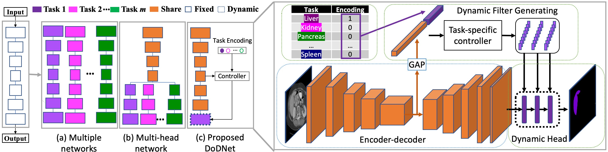
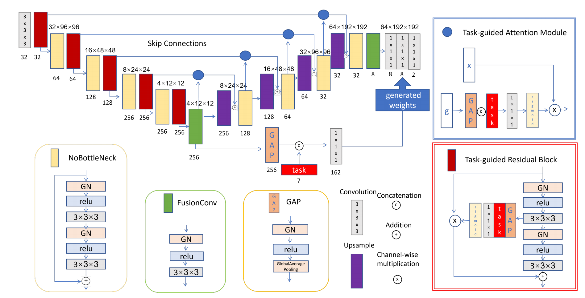
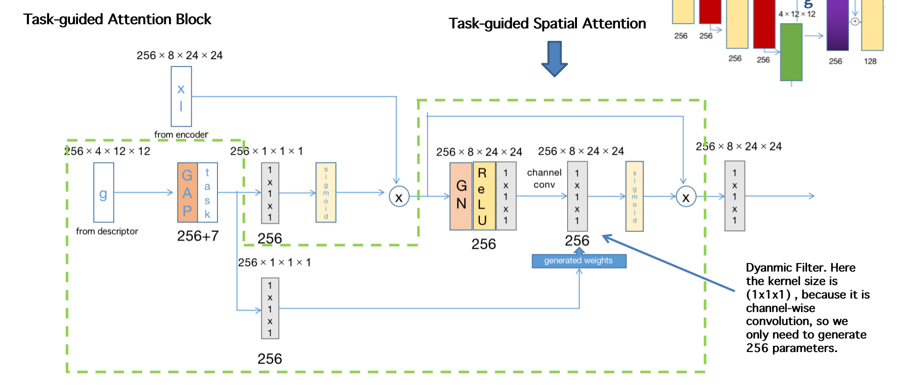

The first part is the illustration of the DODNet. Because TGNet is based on DoDNet and for a fair comparison, the procedure is almost the same, you just need to change the command at Training, Evaluation and Post-processing section.
In DynConv: DynBlockFcAtt and DynBlcokFcCsAtt are two files about TGNet

=================================================
# DoDNet
<p align="left">
    
</p>


This repo holds the pytorch implementation of DoDNet:<br />

**DoDNet: Learning to segment multi-organ and tumors from multiple partially labeled datasets.** 
(https://arxiv.org/pdf/2011.10217.pdf)

## Requirements
Python 3.7<br />
PyTorch==1.4.0<br />
[Apex==0.1](https://github.com/NVIDIA/apex)<br />
[batchgenerators](https://github.com/MIC-DKFZ/batchgenerators)<br />

## Usage

### 0. Installation
* Clone this repo

### 1. MOTS Dataset Preparation
Before starting, MOTS should be re-built from the serveral medical organ and tumor segmentation datasets

Partial-label task | Data source
--- | :---:
Liver | [data](https://competitions.codalab.org/competitions/17094)
Kidney | [data](https://kits19.grand-challenge.org/data/)
Hepatic Vessel | [data](http://medicaldecathlon.com/)
Pancreas | [data](http://medicaldecathlon.com/)
Colon | [data](http://medicaldecathlon.com/)
Lung | [data](http://medicaldecathlon.com/)
Spleen | [data](http://medicaldecathlon.com/)

* Download and put these datasets in `dataset/0123456/`. 
* Re-spacing the data by `python re_spacing.py`, the re-spaced data will be saved in `0123456_spacing_same/`.

The folder structure of dataset should be like

    dataset/0123456_spacing_same/
    ├── 0Liver
    |    └── imagesTr
    |        ├── liver_0.nii.gz
    |        ├── liver_1.nii.gz
    |        ├── ...
    |    └── labelsTr
    |        ├── liver_0.nii.gz
    |        ├── liver_1.nii.gz
    |        ├── ...
    ├── 1Kidney
    ├── ...


### 2. Model
Pretrained model is available in [checkpoint](https://drive.google.com/file/d/1qj8dJ_G1sHiCmJx_IQjACQhjUQnb4flg/view?usp=sharing)

### 3. Training
* cd `a_DynConv/' and run 
```
CUDA_VISIBLE_DEVICES=0,1 python -m torch.distributed.launch --nproc_per_node=2 --master_port=$RANDOM train.py \
--train_list='list/MOTS/MOTS_train.txt' \
--snapshot_dir='snapshots/dodnet' \
--input_size='64,192,192' \
--batch_size=2 \
--num_gpus=2 \
--num_epochs=1000 \
--start_epoch=0 \
--learning_rate=1e-2 \
--num_classes=2 \
--num_workers=8 \
--weight_std=True \
--random_mirror=True \
--random_scale=True \
--FP16=False
```

### 4. Evaluation
```
CUDA_VISIBLE_DEVICES=0 python evaluate.py \
--val_list='list/MOTS/MOTS_test.txt' \
--reload_from_checkpoint=True \
--reload_path='snapshots/dodnet/MOTS_DynConv_checkpoint.pth' \
--save_path='outputs/' \
--input_size='64,192,192' \
--batch_size=1 \
--num_gpus=1 \
--num_workers=2
```

### 5. Post-processing
```
python postp.py --img_folder_path='outputs/dodnet/'
```


======================================================


###TGNet

This figure shows DynBlockFcAtt, which is the model presented in my paper 

<p align="left">
    
</p>

This figure shows DynBlockFcCsAtt, where I add task_guided spatial attention.

<p align="left">
    
</p>


Training
* cd `a_DynConv/' and run 
```
CUDA_VISIBLE_DEVICES=0,1 python -m torch.distributed.launch --nproc_per_node=2 --master_port=$RANDOM trainDynBlockFcCsAtt.py \
--train_list='list/MOTS/MOTS_train.txt' \
--snapshot_dir='snapshots/DynBlockFcCsAtt' \
--input_size='64,192,192' \
--batch_size=2 \
--num_gpus=2 \
--num_epochs=1000 \
--start_epoch=0 \
--learning_rate=1e-2 \
--num_classes=2 \
--num_workers=8 \
--weight_std=True \
--random_mirror=True \
--random_scale=True \
--FP16=False
```


4. Evaluation
```
CUDA_VISIBLE_DEVICES=0 python evaluateDynBlockFcCSAtt.py \
--val_list='list/MOTS/MOTS_test.txt' \
--reload_from_checkpoint=True \
--reload_path='snapshots/DynBlockFcCsAtt/MOTS_DynConv_checkpoint.pth' \
--save_path='outputs/' \
--input_size='64,192,192' \
--batch_size=1 \
--num_gpus=1 \
--num_workers=2
```

5. Post-processing
```
python postp.py --img_folder_path='outputs/DynBlockFcCsAtt/'
```
